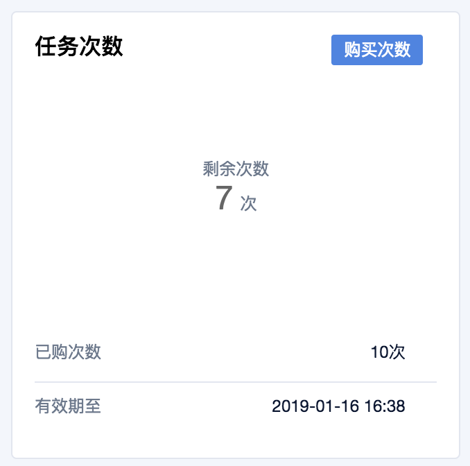
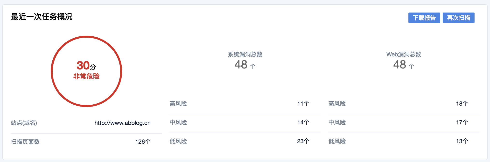

{{indexmenu_n>1}}

# 1、任务管理

WEB漏洞扫描系统的任务次数，等于您可以创建针对站点域名的漏洞扫描次数；每次购买任务次数将刷新到期时间至您当前时间的一年后。

==如果需要查看更多详细信息，比如漏洞的详情和处理建议，请【下载报告】后查看。界面上仅展示概览信息。==

### 任务次数

参数说明

| 参数   | 说明                      |
| --- | --- |
| 剩余次数 | 剩余的还能够创建扫描任务的次数         |
| 已购次数 | 历史上已经购买的次数              |
| 有效期至 | 次数的有效期为1年，以最近1次购买的有效期为准 |

### 最近1次任务概况

参数说明

| 参数          | 说明                                    |
| --- | --- |
| 任务状态        | 包括：正在排队、扫描中、已完成（不显示已完成，显示具体扫描出来的危险等级） |
| 危险等级        | 包括：非常危险（高）、危险（中）、有风险（低）、非常安全（安全）      |
| 站点域名        | 扫描任务时对应的域名                            |
| 扫描页面数       | 扫描采集的页面总数                             |
| 系统漏洞总数      | 系统类型的漏洞总数                             |
| 系统漏洞总数-高风险  | 系统类型的高风险漏洞总数                          |
| 系统漏洞总数-中风险  | 系统类型的中风险漏洞总数                          |
| 系统漏洞总数-低风险  | 系统类型的低风险漏洞总数                          |
| web漏洞总数-高风险 | Web类型的高风险漏洞总数                         |
| web漏洞总数-中风险 | web类型的中风险漏洞总数                         |
| web漏洞总数-低风险 | web类型的低风险漏洞总数                         |
